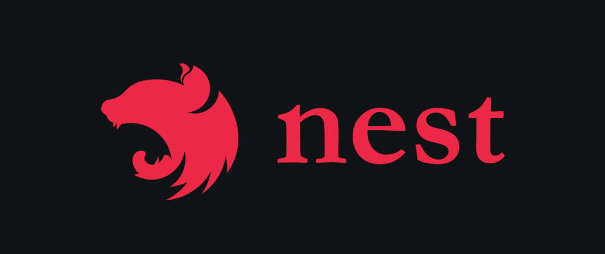

# Neode with NestJS

A module to connect Neode, Neo4j and NestJS.

`npm i neode-nestjs` or `yarn add neode-nestjs`



#### Variables

> .env

If your connection fail check if you are reading your .env settings before start your application
You must add `env-cmd` before your script

```json
{
     "start:dev": "env-cmd nest start --watch"
}
```

```shell
NEO4J_DATABASE=neo4j
NEO4J_USERNAME=neo4j
NEO4J_PASSWORD=your-password
NEO4J_HOST=localhost
NEO4J_PORT=7687
NEO4J_PROTOCOL=neo4j
NEO4J_ENCRYPTION=ENCRYPTION_OFF
```

---

#### Main module

```ts
import { NeodeModule } from 'neode-nestjs';
```

> app.module.ts

```ts
@Module({
     imports: [NeodeModule.forRoot(), UserModule],
     controllers: [AppController],
     providers: [],
})
export class AppModule {}
```

---

#### Entities or Schemas

> Your schema to inject on module

Important when you import `Neode` if throw types error you should use import like example bellow.

```ts
import * as Neode from 'neode';
```


> Schema

```ts
import { SchemaObject } from 'neode';

const UserSchema: SchemaObject = {
     id: {
          type: 'uuid',
          primary: true,
          required: true,
     },
     name: {
          type: 'string',
          required: true,
     },
     email: {
          type: 'string',
          unique: true,
          required: true,
     },
     password: {
          type: 'string',
          required: true,
     },
     avatar: {
          type: 'string',
     },
     isFirstAuth: {
          type: 'boolean',
     },
};

export default UserSchema;
```

---

#### Specific module

```ts
@Module({
     imports: [NeodeModule.forFeature({ User: UserSchema })],
     controllers: [UserController],
     providers: [UserService],
})
export class UserModule {}
```

---

#### User interface

Example User interface

```ts
export interface UserInterface {
     id: string;
     name: string;
     email: string;
     password: string;
     avatar: string;
     isFirstAuth: boolean;
}
```

---

#### Create user dto

Dto example if you are using rest api.
The decorator validation `@IsEmail` refer to `class-validator`

```ts
export class CreateUserDto implements Partial<UserInterface> {
     @IsNotEmpty()
     avatar!: string;

     @IsEmail()
     @IsNotEmpty()
     email!: string;

     @IsString()
     @IsNotEmpty()
     name!: string;

     @IsNotEmpty()
     @IsString()
     password!: string;
}
```

#### Service class

You can get connection by injected `Connection`. It returns a Neode instance

The word `'User'` is the same you have used to inject on `{ User: UserSchema }` if you use same different word as not `User` you must to use it.

```ts
@Injectable()
export class UserService {
     constructor(@Inject('Connection') private readonly neode: Neode) {}

     async createUser(dto: CreateUserDto): Promise<void> {
          // note that on example my interface has id and isFirstAuth attributes, and my Dto not.
          // Generate id
          const id: string = uuid();
          // Set isFirstAuth
          const isFirstAuth: boolean = true;

          await this.neode.merge('User', { ...dto, id, isFirstAuth });
     }

     async getUsers(): Promise<UserInterface[]> {
          const users = await this.neode.all('User');
          return (await users.toJson()) as UserInterface[];
     }
}
```

References

-    [ Neode ](https://www.npmjs.com/package/neode 'Neode npm page')
-    [ Neo4J ](https://www.npmjs.com/package/neo4j-driver 'Neo4j Driver npm page')
-    [ NestJS ](https://nestjs.com/ 'NestJS home page')
-    [Class Validator](https://www.npmjs.com/package/class-validator 'Class validator npm page')
-    [Env Cmd](https://www.npmjs.com/package/env-cmd 'Env cmd npm page')
